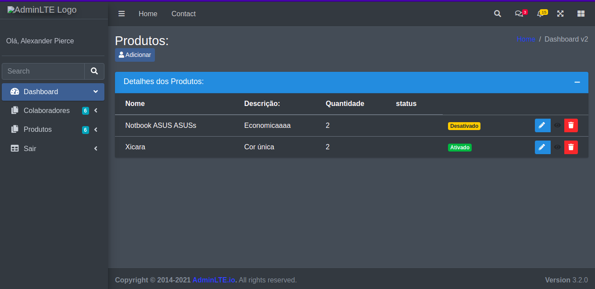

### Olá, disponibilizei algumas rotas API usando recurso JWT, está no final dessa página 👋

## Tela de login:

## Tela de colaboradores:

## Tela de produtos:

### Rotas disponíveis - V1 - Consumir com algum Http Client de sua preferencia

Configuramos algumas rotas para a API

**Primeiro Acesso method POST**

> Login de acesso.

http://localhost/codeignite3-ecommerce/api/v1/conta/login

**Rotas GET**

> Listar todos os produtos.

http://localhost/codeignite3-ecommerce/api/v1/produtos

**Rotas POST**

> Criando um produto.

http://localhost/codeignite3-ecommerce/api/v1/produtos/register

**Rotas PUT**

> Atualizando um produto.

http://localhost/codeignite3-ecommerce/api/v1/produtos/update/3

**Rotas DELETE**

> Deletando um produto.

http://localhost/codeignite3-ecommerce/api/v1/produtos/deletando/3
